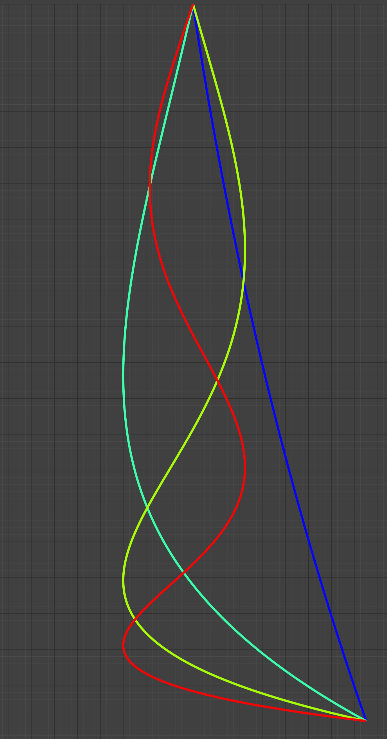

# Transverse Normal Modes of a Vertical Heavy Chain

Derivation of the differential equation, the transverse normal modes, and their frequencies, for a heavy chain hanging vertically. Originally written on June 17, 1995.

First 4 transverse normal modes.

## License

I'm sharing this work under the [Creative Commons Attribution-ShareAlike 4.0 International (CC BY-SA 4.0)](http://creativecommons.org/licenses/by-sa/4.0/) license. See the LICENSE file for more information.
